# 5-Day Scrum Sprint Plan (Archelite Task Manager)

This document outlines a highly focused, clean 5-day Scrum plan to build and deliver the MVP of the Construction Task Management application.

---

## 📅 Sprint Roadmap (Days 1–5)

```mermaid
gantt
    title 5-Day MVP Sprint Roadmap
    dateFormat  D
    axisFormat Day %d
    section Day 1
    Schema & Auth Foundation        :active, d1, 1, 1d
    section Day 2
    WatermelonDB Sync Engine        :d2, after d1, 1d
    section Day 3
    WhatsApp-Style Inbox UI         :d3, after d2, 1d
    section Day 4
    Chat Details & Local Uploads    :d4, after d3, 1d
    section Day 5
    Approvals, States & Translations :d5, after d4, 1d
```



---

### Day 1: Schema Migration, Seeding & OTP Authentication Setup
* **Ticket ID:** `ARCH-101`
* **Description:** Deploy the PostgreSQL schema, run the database seeding script, and implement the local Mock OTP authentication flow on both Next.js and Expo.
* **Technical Guidance:**
  1. Initialize local PostgreSQL schema tables:
     ```bash
     npx prisma db push --schema=packages/database/schema.prisma
     ```
  2. Seed default categories, projects, and employees:
     ```bash
     npx prisma db seed --schema=packages/database/schema.prisma
     ```
  3. Create an authentication page on Mobile. Trigger `POST /api/auth/otp` and verify using code `123456`. Secure mobile sessions using local persistent storage.
* **Acceptance Criteria:**
  - Standard categories and employees exist in PostgreSQL.
  - The login view successfully verifies the mock OTP and sets a user session.

---

### Day 2: Offline-First SQLite Sync Engine Setup
* **Ticket ID:** `ARCH-102`
* **Description:** Configure WatermelonDB on the Expo mobile client and connect it to the Next.js `/api/sync` endpoints to establish offline-first bidirectional data updates.
* **Technical Guidance:**
  1. Map local SQLite models to correspond with the database tables (`tasks`, `comments`, `task_assignments`, `approval_requests`, `categories`).
  2. Set up a sync utility triggering `GET /api/sync` for incremental updates and `POST /api/sync` for local batch modifications.
  3. Restrict pull results: Members only retrieve tasks they are assigned/involved in, while Admins sync all data.
* **Acceptance Criteria:**
  - Creating tasks offline stores them locally and syncs them automatically upon reconnecting.

---

### Day 3: WhatsApp-Style Mobile Task List UI
* **Ticket ID:** `ARCH-103`
* **Description:** Build the main dashboard layout styled as a conversational inbox using Shopify's `FlashList` for virtualized rendering.
* **Technical Guidance:**
  1. List items must resemble active chat bubbles: Display Task title, category badge, employee avatars, relative time, last comment excerpt, and a priority indicator dot (red, orange, green).
  2. Order the list dynamically by the `lastActivityAt` timestamp (most recent chats on top).
  3. Include a green Floating Action Button (FAB) in the corner to compose new task threads.
* **Acceptance Criteria:**
  - Scroll performance is fluid and responsive on low-end Android simulators.
  - Pull-to-refresh triggers the database sync.

---

### Day 4: Chat Room Conversation Details & S3 Presigned Uploads
* **Ticket ID:** `ARCH-104`
* **Description:** Implement the conversational chat thread page for tasks, featuring voice note audio recording and file uploads.
* **Technical Guidance:**
  1. Display pinned task title and descriptions at the top of the detail screen.
  2. incoming messages render left (gray bubbles), outgoing messages render right (green bubbles).
  3. Build a bottom input bar featuring camera capture (`expo-image-picker`), audio recording (`expo-av`), and attachment pre-signing endpoints mapping back to `/api/storage/presign`.
* **Acceptance Criteria:**
  - Messages and voice note recordings are successfully stored in SQLite locally and upload media assets to S3 (falling back to `/api/storage/mock-upload` in dev mode).

---

### Day 5: Approvals Flow, Status Transitions & Multilingual Switcher
* **Ticket ID:** `ARCH-105`
* **Description:** Build in-thread approval request elements, validation of task state transitions, and Hindi/Telugu translations.
* **Technical Guidance:**
  1. Implement in-thread card widgets showing pending approvals with Approve/Reject actions restricted to the selected supervisor.
  2. Block non-owners/non-admins from transitioning a task state to "Closed".
  3. Set up translation locales (`i18next`) and package local Telugu and Devanagari fonts in `/assets/fonts` to ensure correct script display.
* **Acceptance Criteria:**
  - Successful verification actions advance task status fields.
  - Clicking the language setting updates UI texts immediately without requiring application restarts.
