# 📅 5-Day Scrum Sprint Plan

This document contains the complete **5-Day Scrum Sprint Plan** with Jira-style tickets for the Construction Task & Workflow Management Application.

---

## 🗺️ Sprint Roadmap (Gantt Chart)

```mermaid
gantt
    title 5-Day MVP Sprint Roadmap
    dateFormat  X
    axisFormat Day %d
    
    section Day 1: Setup & Infra
    CTMS-001 (Monorepo Scaffold)     :active, d1_1, 0, 3h
    CTMS-002 (Postgres + Prisma)     :active, d1_2, after d1_1, 4h
    CTMS-003 (Fastify API Skeleton)  :active, d1_3, after d1_2, 2h
    CTMS-004 (Expo Init & Nav)       :active, d1_4, after d1_3, 3h
    
    section Day 2: Auth & Users
    CTMS-005 (Phone OTP API)         :d2_1, after d1_4, 4h
    CTMS-006 (Auth Middleware & CASL) :d2_2, after d2_1, 3h
    CTMS-007 (Login OTP UI Mobile)    :d2_3, after d2_2, 4h
    CTMS-008 (Employee CRUD API)     :d2_4, after d2_3, 3h
    
    section Day 3: Task Engine
    CTMS-009 (Task CRUD & Assign API) :d3_1, after d2_4, 5h
    CTMS-010 (Task Lists UI Mobile)   :d3_2, after d3_1, 5h
    CTMS-011 (Create Task UI Mobile)  :d3_3, after d3_2, 4h
    
    section Day 4: Chat & Uploads
    CTMS-012 (Real-time Comments API) :d4_1, after d3_3, 5h
    CTMS-013 (S3 Attachment API)      :d4_2, after d4_1, 4h
    CTMS-014 (Approval Requests API)  :d4_3, after d4_2, 3h
    CTMS-015 (Comment Thread UI)      :d4_4, after d4_3, 4h
    
    section Day 5: Push & Polish
    CTMS-016 (Push Notifications FCM) :d5_1, after d4_4, 4h
    CTMS-017 (Filter, Sort & Search)  :d5_2, after d5_1, 3h
    CTMS-018 (Next.js Admin Panel)    :d5_3, after d5_2, 4h
    CTMS-019 (Offline Queue & Sentry) :d5_4, after d5_3, 3h
```

---

## 📊 Sprint Ticket Reference Table

| Ticket ID | Title | Priority | Category | Estimate |
| :--- | :--- | :---: | :--- | :---: |
| **CTMS-001** | Monorepo scaffold with Turborepo | 🔴 Critical | Setup | 3h |
| **CTMS-002** | Postgres + Prisma schema setup | 🔴 Critical | Database | 4h |
| **CTMS-003** | Fastify API skeleton + env config | 🟠 High | Infra | 2h |
| **CTMS-004** | Expo app init + navigation scaffold | 🟠 High | Mobile | 3h |
| **CTMS-005** | Phone OTP auth — API endpoints | 🔴 Critical | Auth | 4h |
| **CTMS-006** | Auth middleware + CASL permission layer | 🔴 Critical | Auth | 3h |
| **CTMS-007** | Login & OTP screen — Mobile | 🔴 Critical | Mobile | 4h |
| **CTMS-008** | Employee CRUD API (Admin) | 🟠 High | Feature | 3h |
| **CTMS-009** | Task CRUD + assignment API | 🔴 Critical | Feature | 5h |
| **CTMS-010** | Task list & detail screens — Mobile | 🔴 Critical | Mobile | 5h |
| **CTMS-011** | Create task screen — Mobile | 🔴 Critical | Mobile | 4h |
| **CTMS-012** | Comments API + real-time via Socket.io | 🔴 Critical | Feature | 5h |
| **CTMS-013** | File upload to S3 + attachment API | 🔴 Critical | Feature | 4h |
| **CTMS-014** | Approval request API + flow | 🟠 High | Feature | 3h |
| **CTMS-015** | Comment thread UI + attachment composer | 🟠 High | Mobile | 4h |
| **CTMS-016** | Push notifications via Expo + FCM | 🔴 Critical | Feature | 4h |
| **CTMS-017** | Filter, sort & search — API + Mobile UI | 🟠 High | Feature | 3h |
| **CTMS-018** | Admin panel — Next.js employee management | 🟠 High | Admin | 4h |
| **CTMS-019** | Offline queue + Sentry setup | 🟠 High | Infra | 3h |

---

# 📅 Detailed Tickets by Day

## 🏁 Day 1 — Project Setup & Infrastructure
> [!NOTE]
> Focuses on laying the core foundation that all subsequent modules build on.

### 🎫 CTMS-001: Monorepo scaffold with Turborepo
- **Category:** Setup
- **Priority:** 🔴 Critical
- **Estimate:** 3h
- **Tech Stack:** `Turborepo`, `TypeScript`, `ESLint`, `Prettier`

#### **Description**
Bootstrap a Turborepo monorepo with three packages: `apps/mobile` (Expo), `apps/admin` (Next.js), `apps/api` (Fastify). Set up shared `packages/types` and `packages/db` (Prisma). Configure TypeScript, ESLint, Prettier across all packages with shared configs.

#### **How to Implement**
`npx create-turbo@latest` &rarr; restructure into apps/packages layout &rarr; configure `turbo.json` pipeline (build, dev, lint tasks) &rarr; shared `tsconfig.base.json` extended per app.

#### **Acceptance Criteria**
- [ ] `turbo dev` starts all three apps simultaneously.
- [ ] TypeScript compiles with zero errors across all packages.
- [ ] Shared type from `packages/types` is importable in both mobile and API.
- [ ] ESLint passes on all packages.

---

### 🎫 CTMS-002: Postgres + Prisma schema setup
- **Category:** Database
- **Priority:** 🔴 Critical
- **Estimate:** 4h
- **Tech Stack:** `Prisma`, `PostgreSQL`, `Railway`

#### **Description**
Define the full Prisma schema in `packages/db` covering all entities from the PRD: Employee, Task, TaskAssignment, Comment, Attachment, ApprovalRequest, Category, Project, AuditLog, Notification. Run initial migration. Seed with test categories and two test employees.

#### **How to Implement**
Write `schema.prisma` with all models and enums (`AccessRole`, `OrgLevel`, `Priority`, `TaskStatus`, etc.) &rarr; `prisma migrate dev --name init` &rarr; write `seed.ts` with categories (Accounting, Construction, Invoice) + 1 Super Admin + 1 Member employee.

#### **Acceptance Criteria**
- [ ] All 11 models are present in the schema with correct relations.
- [ ] Migration runs cleanly on a fresh Postgres instance.
- [ ] Seed script populates the database without errors.
- [ ] Prisma Studio shows all tables with seed data.
- [ ] Foreign key constraints are enforced (test with invalid insert).

---

### 🎫 CTMS-003: Fastify API skeleton + env config
- **Category:** Infra
- **Priority:** 🟠 High
- **Estimate:** 2h
- **Tech Stack:** `Fastify`, `Zod`, `Prisma client`

#### **Description**
Bootstrap `apps/api` as a Fastify server with Prisma client injected, CORS configured, health check endpoint, and environment variable validation using `zod`. Set up basic route structure (auth, tasks, users, notifications routers).

#### **How to Implement**
Install `fastify` + `@fastify/cors` + `fastify-plugin` &rarr; create prisma plugin &rarr; add `GET /health` route returning `{status:"ok",db:"connected"}` &rarr; zod schema for env vars (`DATABASE_URL`, `JWT_SECRET`, etc.) &rarr; register empty routers for each domain.

#### **Acceptance Criteria**
- [ ] `GET /health` returns 200 with DB connected status.
- [ ] App fails fast with clear error if required env vars are missing.
- [ ] CORS allows mobile app origin in dev.
- [ ] Route structure matches planned API domains.

---

### 🎫 CTMS-004: Expo app init + navigation scaffold
- **Category:** Mobile
- **Priority:** 🟠 High
- **Estimate:** 3h
- **Tech Stack:** `Expo Router`, `i18next`, `Zustand`, `React Query`

#### **Description**
Create the Expo app with Expo Router (file-based routing). Set up screen structure: auth stack (Login, OTP), main tab navigator (Tasks, Notifications, Profile), and task stack (TaskList, TaskDetail, CreateTask). Install and configure i18next with English, Hindi, Telugu JSON files. Set up Zustand store skeleton and React Query client.

#### **How to Implement**
`npx create-expo-app` with TypeScript template &rarr; install `expo-router` &rarr; create route files per screen &rarr; install `react-i18next` + `i18next`, add 3 locale JSON files with 5-10 sample keys &rarr; install `zustand` + `@tanstack/react-query` &rarr; wrap app in providers.

#### **Acceptance Criteria**
- [ ] App runs on iOS Simulator and Android Emulator.
- [ ] Navigation between all placeholder screens works.
- [ ] Language toggle switches UI text between EN/HI/TE instantly.
- [ ] React Query devtools visible in dev mode.

---

## 🔐 Day 2 — Authentication & User Management
> [!NOTE]
> Includes setting up the secure login gateway, SMS delivery, roles, and administrative CRUD operations for employees.

### 🎫 CTMS-005: Phone OTP auth — API endpoints
- **Category:** Auth
- **Priority:** 🔴 Critical
- **Estimate:** 4h
- **Tech Stack:** `MSG91`, `Redis (Upstash)`, `JWT`, `bcrypt`

#### **Description**
Build the full OTP auth flow on the API: request OTP (store hashed OTP + expiry in Redis), verify OTP (return JWT access token + refresh token), refresh token endpoint, and logout. Integrate MSG91 for SMS delivery. Implement rate limiting (5 attempts per phone per 10 min).

#### **How to Implement**
`POST /auth/request-otp` &rarr; generate 6-digit OTP &rarr; store `hashed:phone:otp` in Redis with 5min TTL &rarr; send via MSG91 API &rarr; `POST /auth/verify-otp` &rarr; compare hash &rarr; issue JWT (15min) + refresh token (30 days, stored in DB) &rarr; `POST /auth/refresh` &rarr; `POST /auth/logout` (invalidate refresh token).

#### **Acceptance Criteria**
- [ ] OTP SMS is delivered to a real phone within 30 seconds.
- [ ] Wrong OTP returns 401 with attempt count.
- [ ] Expired OTP (after 5 min) is rejected correctly.
- [ ] JWT contains employee ID, role, and organization level.
- [ ] Rate limiter blocks after 5 failed attempts.
- [ ] Refresh token rotates on each use.

---

### 🎫 CTMS-006: Auth middleware + CASL permission layer
- **Category:** Auth
- **Priority:** 🔴 Critical
- **Estimate:** 3h
- **Tech Stack:** `CASL`, `Fastify hooks`, `JWT`

#### **Description**
Implement JWT verification middleware that attaches the authenticated employee to the request context. Define CASL ability rules that exactly mirror the permission matrix in §3.4 of the PRD. Protect all non-auth routes with the middleware.

#### **How to Implement**
Fastify `preHandler` hook &rarr; verify JWT, load employee from DB, attach to `request.user` &rarr; define `defineAbilityFor(employee)` using `@casl/ability` &rarr; rules: Super Admin can manage all, Admin can manage employees (not Super Admin), Member can only read/update tasks they're in.

#### **Acceptance Criteria**
- [ ] Request without token returns 401.
- [ ] Member cannot access `GET /users` (admin-only) — returns 403.
- [ ] Super Admin can access all endpoints.
- [ ] CASL rules tested for all 3 roles &times; all major capabilities.

---

### 🎫 CTMS-007: Login & OTP screen — Mobile
- **Category:** Mobile
- **Priority:** 🔴 Critical
- **Estimate:** 4h
- **Tech Stack:** `expo-secure-store`, `expo-local-authentication`, `React Query mutation`

#### **Description**
Build the two-step login flow on mobile: phone number entry screen (country code + number) &rarr; OTP entry screen (6-digit, auto-submit on last digit). Store JWT + refresh token in SecureStore. On success navigate to main app. On first login, navigate to language picker screen.

#### **How to Implement**
Phone screen: `react-native-phone-number-input` + API call to `/auth/request-otp` &rarr; OTP screen: 6 individual TextInput boxes side-by-side, auto-focus on fill &rarr; on verify success: `expo-secure-store` to persist tokens &rarr; check `employee.preferredLanguage` null &rarr; route to onboarding or main tabs.

#### **Acceptance Criteria**
- [ ] Keyboard auto-shows on screen open.
- [ ] OTP auto-submits when 6th digit is entered.
- [ ] Tokens are stored securely (not AsyncStorage).
- [ ] Error message is shown in selected language (EN/HI/TE).
- [ ] Biometric prompt appears on next app open after first login.

---

### 🎫 CTMS-008: Employee CRUD API (Admin)
- **Category:** Feature
- **Priority:** 🟠 High
- **Estimate:** 3h
- **Tech Stack:** `Fastify`, `Prisma`, `Zod validation`

#### **Description**
Build Admin/Super Admin endpoints for employee management: list employees (paginated, searchable), get single employee, create employee, update employee, deactivate employee (never hard delete). All fields from PRD §5.2 must be supported including blood group and org level.

#### **How to Implement**
`GET /employees` (paginated, filter by status/role) &rarr; `GET /employees/:id` &rarr; `POST /employees` (Admin+, validate phone unique) &rarr; `PUT /employees/:id` &rarr; `DELETE /employees/:id` sets `status=inactive` only. All routes guarded by CASL (Admin+ required).

#### **Acceptance Criteria**
- [ ] Member calling these routes gets 403.
- [ ] Deactivated employee cannot log in (OTP returns 403).
- [ ] Task history is preserved after deactivation.
- [ ] Phone number uniqueness is enforced at DB level.
- [ ] Pagination returns correct total count and next cursor.

---

## ⚙️ Day 3 — Core Task Engine
> [!NOTE]
> Implements the transactional task logic, assigning users, status transition flows, and conversational screen layouts.

### 🎫 CTMS-009: Task CRUD + assignment API
- **Category:** Feature
- **Priority:** 🔴 Critical
- **Estimate:** 5h
- **Tech Stack:** `Prisma transactions`, `BullMQ`, `CASL`

#### **Description**
The core task API: create task with multi-assignee support (first = owner, rest = collaborators), update task fields, change status (enforcing valid state transitions from PRD §5.4), add/remove collaborators, reassign owner. Every mutation writes an AuditLog entry. Members only see tasks they're involved in; Admins see all.

#### **How to Implement**
`POST /tasks` (create + assign, emit notification) &rarr; `GET /tasks` (filtered by role: member gets WHERE involved, admin gets all) &rarr; `GET /tasks/:id` &rarr; `PUT /tasks/:id` (fields) &rarr; `PATCH /tasks/:id/status` (validate transition matrix) &rarr; `POST /tasks/:id/assignees` &rarr; `DELETE /tasks/:id/assignees/:employeeId`. Each mutation appends AuditLog row with actor/from/to.

#### **Acceptance Criteria**
- [ ] Invalid status transition (e.g. Closed &rarr; Needs Action) returns 400 with reason.
- [ ] Member cannot see tasks they're not involved in.
- [ ] Every status change creates an AuditLog entry.
- [ ] Task creation triggers notifications to all assignees.
- [ ] `GET /tasks` returns sorted by `last_activity_at` by default.
- [ ] Multi-assignee: first is owner, rest are collaborators.

---

### 🎫 CTMS-010: Task list & detail screens — Mobile
- **Category:** Mobile
- **Priority:** 🔴 Critical
- **Estimate:** 5h
- **Tech Stack:** `FlashList`, `React Query`, `expo-haptics`

#### **Description**
The WhatsApp-style task list (home screen): each row shows avatar(s), task title, last comment snippet, relative time, unread badge, and a priority color dot. Task detail screen shows pinned description at top, status + priority chips (tappable), assignee row, and comment thread below. Use FlashList for performance.

#### **How to Implement**
TaskList: `FlashList` + React Query infinite query on `GET /tasks` &rarr; custom TaskRow component with priority dot colors &rarr; pull-to-refresh. TaskDetail: sticky header with task meta, ScrollView for comment thread, status chip with bottom sheet picker, priority chip. All text from i18n keys.

#### **Acceptance Criteria**
- [ ] List scrolls at 60fps with 50+ tasks (FlashList).
- [ ] Pull-to-refresh fetches latest data.
- [ ] Priority dots match correct color (red=Critical, orange=High, green=Medium).
- [ ] Status chip opens a picker and updates via API on selection.
- [ ] Relative timestamps are localized in the active language.

---

### 🎫 CTMS-011: Create task screen — Mobile
- **Category:** Mobile
- **Priority:** 🔴 Critical
- **Estimate:** 4h
- **Tech Stack:** `React Hook Form`, `Optimistic updates`, `Bottom sheet`

#### **Description**
The "start a chat" task creation flow: FAB on task list opens a bottom sheet / full screen form with title, description, assignee picker (searchable employee list), priority selector, due date picker, and category dropdown. Should feel instant — auto-focus title on open.

#### **How to Implement**
FAB &rarr; open modal with auto-focused title TextInput &rarr; assignee picker: debounced search against `GET /employees?q=`, multi-select with avatar chips &rarr; priority: horizontal pill row (Low/Medium/High/Critical/Urgent) &rarr; due date: `@react-native-community/datetimepicker` &rarr; submit calls `POST /tasks`, optimistic update to list.

#### **Acceptance Criteria**
- [ ] Task created in under 10 seconds end-to-end (PRD goal).
- [ ] Assignee search responds in under 300ms (debounced).
- [ ] Form validates: title required, at least 1 assignee required.
- [ ] Created task appears at top of list immediately (optimistic).
- [ ] All labels in the active language.

---

## 💬 Day 4 — Comments, Attachments & Approvals
> [!NOTE]
> Develops the real-time chat engine, image compression, S3 direct uploads, and the supervisor approval workflow.

### 🎫 CTMS-012: Comments API + real-time via Socket.io
- **Category:** Feature
- **Priority:** 🔴 Critical
- **Estimate:** 5h
- **Tech Stack:** `Socket.io`, `Redis pub/sub`, `Prisma`

#### **Description**
Build the comments API and wire up Socket.io so new comments appear live in the task thread without polling. Each task is a Socket.io room. When a comment is posted, broadcast it to all room members. Handle @mentions: parse comment body, notify mentioned employees, add them as task participants if not already.

#### **How to Implement**
`POST /tasks/:id/comments` &rarr; save to DB &rarr; emit `task:{id}:comment` via Socket.io to room &rarr; parse @mentions with regex `/@(\w+)/g` &rarr; look up employees by handle &rarr; create Notification rows + emit individual notification events. Socket auth: JWT passed as handshake auth. `GET /tasks/:id/comments` paginated for initial load.

#### **Acceptance Criteria**
- [ ] Comment appears on second device within 500ms (same wifi).
- [ ] @mentioned user receives in-app notification.
- [ ] @mentioned user is added as task participant if not already.
- [ ] Non-participant cannot join the socket room.
- [ ] Comments paginate correctly (cursor-based, 20 per page).

---

### 🎫 CTMS-013: File upload to S3 + attachment API
- **Category:** Feature
- **Priority:** 🔴 Critical
- **Estimate:** 4h
- **Tech Stack:** `AWS S3 SDK v3`, `expo-image-picker`, `expo-image-manipulator`

#### **Description**
Presigned URL upload flow: mobile requests a presigned S3 URL, uploads directly to S3 (bypassing API server for file bytes), then confirms the upload to the API which saves the Attachment record. Support camera capture and gallery pick. Auto-compress images client-side before upload. 25MB per file limit.

#### **How to Implement**
`POST /attachments/presign` &rarr; generate S3 presigned PUT URL (15min expiry) with content-type + size validation &rarr; mobile uploads directly to S3 &rarr; `POST /attachments/confirm` with S3 key &rarr; save Attachment row. Mobile: `expo-image-picker` &rarr; `expo-image-manipulator` to resize to max 1200px / quality 0.8 before upload &rarr; upload with progress indicator.

#### **Acceptance Criteria**
- [ ] 4MB photo compressed to under 400KB before upload.
- [ ] Upload progress bar is shown during transfer.
- [ ] Files over 25MB are rejected with clear error.
- [ ] Attachment thumbnail appears in comment thread after confirmation.
- [ ] PDF and image files are both supported.
- [ ] S3 bucket is private (only accessible via presigned URLs).

---

### 🎫 CTMS-014: Approval request API + flow
- **Category:** Feature
- **Priority:** 🟠 High
- **Estimate:** 3h
- **Tech Stack:** `Prisma`, `BullMQ notifications`, `CASL`

#### **Description**
Build the approval workflow: any task participant can request approval from any employee. The approver gets a notification and can Approve (with mandatory comment, task moves to Closed) or Reject (with mandatory comment, task returns to In Progress). Only one pending approval per task at a time.

#### **How to Implement**
`POST /tasks/:id/approvals` (requester picks approver) &rarr; validate no pending approval exists &rarr; create `ApprovalRequest`(pending) &rarr; notify approver &rarr; `PATCH /tasks/:id/approvals/:approvalId` (approve|reject + comment, only callable by the named approver) &rarr; on approve: status &rarr; Closed, AuditLog entry &rarr; on reject: status &rarr; In Progress.

#### **Acceptance Criteria**
- [ ] Only the named approver can approve/reject (others get 403).
- [ ] Approval without decision comment returns 400.
- [ ] Second approval request while one is pending returns 409.
- [ ] Audit log records approval decision with comment.
- [ ] Approver notification is delivered within 2 seconds.

---

### 🎫 CTMS-015: Comment thread UI + attachment composer
- **Category:** Mobile
- **Priority:** 🟠 High
- **Estimate:** 4h
- **Tech Stack:** `Socket.io client`, `FlashList`, `expo-image-picker`

#### **Description**
Build the chat-like comment thread in the task detail screen: chronological messages with author avatar, timestamp, and attachment thumbnails. Bottom composer with text input, attach icon (camera + gallery), and send button. Live updates via Socket.io. @mention autocomplete dropdown when user types @.

#### **How to Implement**
FlashList for message list, inverted=false, scroll to bottom on new message &rarr; composer: TextInput + @mention parser (show employee picker dropdown on @ trigger) &rarr; attach: expo-image-picker sheet &rarr; send triggers POST + optimistic append &rarr; socket listener appends new messages from others in real time.

#### **Acceptance Criteria**
- [ ] New messages from other users appear without refresh.
- [ ] @mention shows employee autocomplete within 200ms.
- [ ] Image thumbnail is tappable &rarr; full screen preview.
- [ ] Keyboard pushes composer up (`KeyboardAvoidingView`).
- [ ] Sending while offline queues and sends on reconnect.

---

## 🚀 Day 5 — Notifications, Filters, Admin Panel & Polish
> [!NOTE]
> Finalizes push integrations, advanced search queries, Next.js web dashboards, and offline queue state synchronizations.

### 🎫 CTMS-016: Push notifications via Expo + FCM
- **Category:** Feature
- **Priority:** 🔴 Critical
- **Estimate:** 4h
- **Tech Stack:** `expo-notifications`, `expo-server-sdk`, `BullMQ`, `FCM`

#### **Description**
Implement end-to-end push notifications: register Expo push token on login and save to Employee record, send pushes via Expo Push API from BullMQ jobs triggered by task events (assigned, commented, @mentioned, approval requested/decided, due date approaching). Build in-app notification center screen.

#### **How to Implement**
Mobile: `expo-notifications` &rarr; request permission &rarr; get push token &rarr; `POST /users/me/push-token` &rarr; API: BullMQ notification jobs triggered after each task event &rarr; `expo-server-sdk` to send push via Expo API &rarr; handle receipt errors (DeviceNotRegistered &rarr; remove token) &rarr; in-app: notification center screen from `GET /notifications`, mark as read.

#### **Acceptance Criteria**
- [ ] Push is delivered within 5 seconds of the triggering event.
- [ ] Tapping push opens the correct task detail screen.
- [ ] Notification badge count is shown on the app icon.
- [ ] In-app notification center shows the unread count.
- [ ] Notifications respect the user's quiet hours setting.

---

### 🎫 CTMS-017: Filter, sort & search — API + Mobile UI
- **Category:** Feature
- **Priority:** 🟠 High
- **Estimate:** 3h
- **Tech Stack:** `Postgres tsvector`, `GIN index`, `Prisma raw query`

#### **Description**
Add filtering and search to `GET /tasks`: filter by priority, status, category, assignee, creator, due-date range, overdue flag. Sort by priority, due date, created date, last activity. Full-text search on title + description + comment body using Postgres tsvector. Build filter sheet UI on mobile with quick filters ("My overdue", "Awaiting my approval").

#### **How to Implement**
API: extend `GET /tasks` with query params &rarr; Prisma where builder (dynamic conditions) &rarr; Postgres full-text: add generated tsvector column on Task, GIN index &rarr; `WHERE tsv @@ plainto_tsquery('english', $query)`. Mobile: filter icon in header &rarr; bottom sheet with filter chips &rarr; quick filter pills row above task list.

#### **Acceptance Criteria**
- [ ] Search returns results within 300ms for a 1000-task dataset.
- [ ] "My overdue" quick filter shows only overdue tasks assigned to me.
- [ ] "Awaiting my approval" shows pending approvals correctly.
- [ ] Multiple filters are combinable (AND logic).
- [ ] Active filters are shown with a count badge on the filter icon.

---

### 🎫 CTMS-018: Admin panel — Next.js employee management
- **Category:** Admin
- **Priority:** 🟠 High
- **Estimate:** 4h
- **Tech Stack:** `Next.js 15`, `shadcn/ui`, `TanStack Table`, `Tailwind`

#### **Description**
Build the web admin console in `apps/admin` (Next.js): login page (email OTP for admins), employee list with search/filter, create employee form, edit employee drawer, deactivate confirmation. Org-wide task overview table (read-only for now). Uses the same Fastify API as mobile.

#### **How to Implement**
Next.js App Router &rarr; `/login` page &rarr; `/employees` (shadcn DataTable with TanStack Table) &rarr; `/employees/new` (shadcn form) &rarr; `/employees/:id` (Sheet drawer with edit form) &rarr; `/tasks` (read-only table, admin view). Auth: same JWT flow, stored in httpOnly cookie for web.

#### **Acceptance Criteria**
- [ ] Admin can create an employee, and they can immediately log in on mobile.
- [ ] Deactivate button requires confirmation and disables login.
- [ ] Employee table is searchable and paginated.
- [ ] Non-admin URL access redirects to login.
- [ ] Works on desktop Chrome and Safari.

---

### 🎫 CTMS-019: Offline queue + Sentry setup
- **Category:** Infra
- **Priority:** 🟠 High
- **Estimate:** 3h
- **Tech Stack:** `@sentry/react-native`, `NetInfo`, `MMKV`, `Zustand persist`

#### **Description**
Implement basic offline resilience: detect network loss, queue comment posts and status changes in AsyncStorage, retry when reconnected. Add Sentry to both the Expo app and Fastify API for crash/error tracking. Set up Sentry source maps for meaningful stack traces.

#### **How to Implement**
NetInfo from `@react-native-community/netinfo` &rarr; when offline: show banner "Working offline", queue mutations in zustand offline slice (persisted via MMKV) &rarr; on reconnect: flush queue in order. Sentry: `@sentry/react-native` in Expo + `@sentry/node` in Fastify &rarr; configure DSN from env &rarr; upload source maps in EAS Build.

#### **Acceptance Criteria**
- [ ] Comment typed offline saves locally and posts automatically when back online.
- [ ] Offline banner is visible when network is lost.
- [ ] Sentry captures unhandled errors in both mobile and API.
- [ ] Sentry dashboard shows readable stack traces (not minified).
- [ ] Test: airplane mode &rarr; post comment &rarr; restore network &rarr; comment appears.
